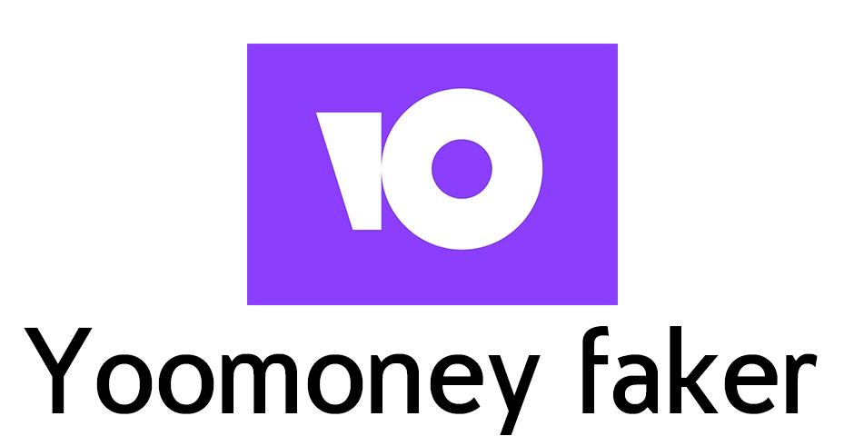

Расширение для подмены баланса Yoomoney и тд.

Подмена баланса при клике на страницу.

Подмена номера телефона при клике на страницу.

Подмена баллов при клике на страницу.

Подмена карты при клике на страницу.

<h2>Поддержка браузеров</h2> 

<b>Вы всегда можете сменить event подмены данных.</b>

